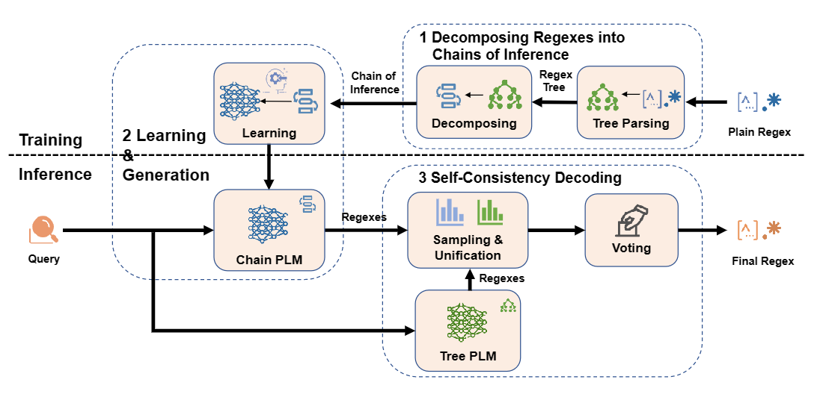
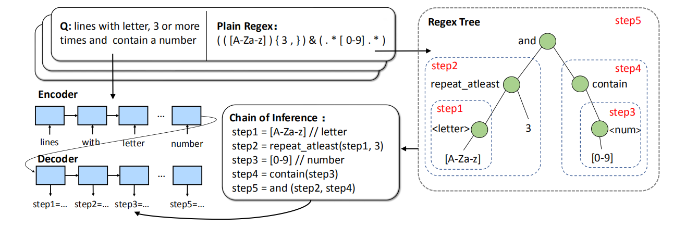
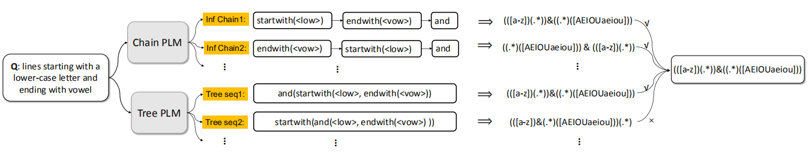
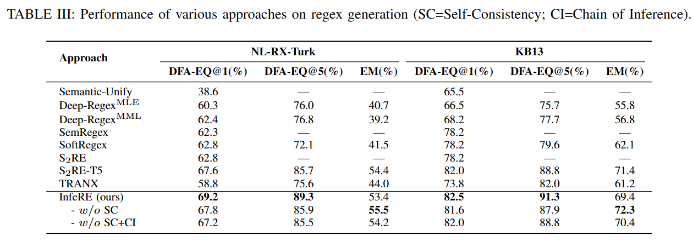

# InfeRE: Step-by-Step Regex Generation via Chain of Inference
This is the implementation of the paper **InfeRE: Step-by-Step Regex Generation via Chain of Inference**
## Summary
Automatically generating regular expressions (abbrev. regexes) from natural language description (NL2RE) has been an emerging research area. Prior studies treat regex as a linear sequence of tokens and generate the final expressions autoregressively in a single pass. They did not take into account
the step-by-step internal text-matching processes behind the final results. This significantly hinders the efficacy and interpretability of regex generation by neural language models. In this paper, we propose a new paradigm called InfeRE, which decomposes the generation of regexes into chains of step-by-step inference. To enhance the robustness, we introduce a self-consistency decoding mechanism that ensembles multiple outputs sampled from different models. We evaluate InfeRE on two
publicly available datasets, NL-RX-Turk and KB13, and compare the results with state-of-the-art approaches and the popular tree-based generation approach TRANX. Experimental results show that InfeRE substantially outperforms previous baselines, yielding 16.3% and 14.7% improvement in DFA@5 accuracy on two datasets, respectively. Particularly, InfeRE outperforms the popular tree-based generation approach by 18.1% and 11.3% on both datasets, respectively, in terms of DFA@5 accuracy.

## Overview
InfeRE involves three main steps. First, we decompose plain regexes into chains of inference, namely, step-by-step operations in the regexes. Second, we train a sequence-to-sequence model to generate the chains of inference. These chains of inference are assembled into plain regexes. Third, we design a self-consistency decoding mechanism that ensembles multiple inference chains.

<br/>


## Chains of Inference
We convert plain regexes into chains of inference, each representing an inferred sub-regex that denotes a text-matching process. Then, we train a sequence-to-sequence model to generate chains of inference from natural language queries and revert them into regexes.

First, we parse the original plain regex into trees based on predefined rules(Read paper for details). We then traverse the tree in a post-order. Whenever we encounter an operator node, we regard the sub-regex corresponding to its sub-tree as a step in the chain of inference. For the i-th node, we represent the sub-regex as step i in the chain of inference. Then, we replace the sub-tree of the current operator with a step-i node. The size of the regex tree decreases 
continuously as the traversal proceeds. We repeat this process until there is only a single step node left in the tree, which means the completion of the chain of inference.

<br/>


## Self-Consistency
Since we formulate regex generation as a chain of inference for text matching, it is natural to suppose that there are multiple chains that lead to the same text matching. Moreover, if multiple chains reach the same matching, that means the generated chains are more convincing. In other words, multiple wrong chains are unlikely to reach the same answer. Therefore, we can sample a group of inference chains from the language model, revert them to plain regexes, and select the most consistent ones (i.e., chains of inference that lead to the same regexes) as the final results.



## Data
Train/valid/test data is under **./data**

## Install from source
``` 
git clone https://github.com/Smallqqqq/InfeRE.git
cd InfeRE
pip install -r requirements.txt 
```

## Train
configure training dataset in *train.sh*, kb13 or turk
```
source train.sh
```
## Eval
configure evaluation dataset in *eval.sh*, kb13 or turk
```
source eval.sh
```
## Main Result

<br/>

